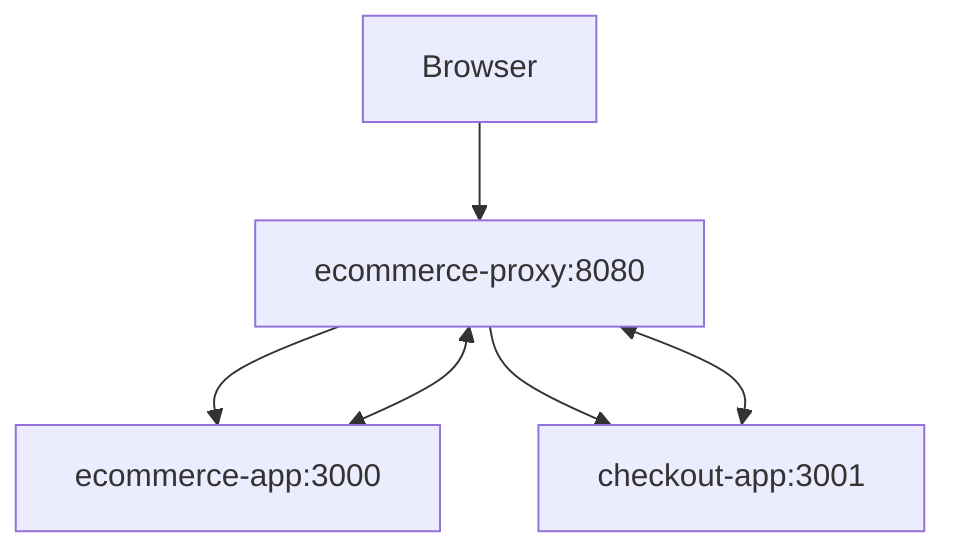

# E-commerce Microfrontend Architecture 🏪

A modern e-commerce platform built using microfrontend architecture with Next.js and Node.js.


## 🚀 Features

- Microfrontend architecture
- Shared state management
- Cart synchronization
- Secure checkout process
- API Gateway/BFF pattern
- Session management
- Health monitoring

## 🛠️ Technology Stack

### Frontend
- Next.js 14
- React.js
- Ant Design
- CSS Modules
- Context API
- TypeScript

### Backend
- Node.js
- Express.js
- http-proxy-middleware
- Express Session

### DevOps
- Docker
- Docker Compose
- Health checks
- Environment management

## 📋 Prerequisites

- Node.js 20.x or later
- npm or yarn
- Docker and Docker Compose
- Git

## 🏃‍♂️ Project Setup

### Local Development

1. Clone the repository:
```bash
git clone https://github.com/nubrao/ecommerce.git
cd ecommerce
```

2. Install dependencies for all services:
```bash
cd ecommerce-app && npm install
cd ../checkout-app && npm install
cd ../ecommerce-proxy && npm install
cd ..
```

3. Set up environment variables for each service (see individual READMEs)

4. Start all services:
```bash
# Terminal 1 - Main App
cd ecommerce-app && npm run dev

# Terminal 2 - Checkout App
cd checkout-app && npm run dev

# Terminal 3 - Proxy
cd ecommerce-proxy && npm run dev
```

### Using Docker

1. Start all services:
```bash
docker compose up
```

2. Access the applications:
- Main Store: http://localhost:8080
- Checkout: http://localhost:8080/checkout

## 🐳 Docker Setup

### Prerequisites
- Docker Desktop for Windows
- Docker Compose
- Git

### Quick Start
1. Clone and start services:
```bash
git clone https://github.com/nubrao/ecommerce.git
cd ecommerce
docker compose up
```

2. Access applications:
- Store: http://localhost:8080
- Checkout: http://localhost:8080/checkout

### Docker Commands

#### Build Services
```bash
# Build all services
docker compose build

# Build specific service
docker compose build ecommerce-app
docker compose build checkout-app
docker compose build ecommerce-proxy
```

#### Start Services
```bash
# Start all services
docker compose up

# Start in detached mode
docker compose up -d

# Start specific service
docker compose up ecommerce-app
```

#### View Logs
```bash
# All services
docker compose logs -f

# Specific service
docker compose logs -f ecommerce-app
docker compose logs -f checkout-app
docker compose logs -f ecommerce-proxy
```

#### Stop Services
```bash
# Stop all
docker compose down

# Remove volumes too
docker compose down -v

# Stop specific service
docker compose stop ecommerce-app
```

### Docker Architecture
```
┌──────────────────┐
│  Docker Network  │
│                  │
│  ┌───────────┐   │
│  │   Proxy   │   │
│  │   :8080   │   │
│  └─────┬─────┘   │
│        │         │
│  ┌─────┴─────┐   │
│  │           │   │
│┌─┴───┐   ┌───┴─┐ │
││ App │   │Check│ │
││:3000│   │:3001│ │
│└─────┘   └─────┘ │
└──────────────────┘
```

### Environment Files

1. Main App (.env):
```env
NODE_ENV=development
NEXT_PUBLIC_PROXY_URL=http://localhost:8080
NEXT_PUBLIC_CHECKOUT_APP_URL=http://localhost:8080/checkout
```

2. Checkout App (.env):
```env
NODE_ENV=development
NEXT_PUBLIC_MAIN_APP_URL=http://localhost:8080
NEXT_PUBLIC_PROXY_URL=http://localhost:8080
NEXT_PUBLIC_CHECKOUT_URL=http://localhost:8080/checkout
```

3. Proxy (.env):
```env
PORT=8080
SESSION_SECRET=your-secret-key
CORS_ORIGINS=http://localhost:3000,http://localhost:3001,http://localhost:8080
NODE_ENV=development
```

### Health Checks
Docker health checks are configured for all services:
```bash
# Check service health
docker compose ps
```

### Troubleshooting

#### Common Issues
1. Port conflicts:
```bash
# Check ports in use
netstat -ano | findstr "8080 3000 3001"
```

2. Container access:
```bash
# Access container shell
docker compose exec ecommerce-app sh
docker compose exec checkout-app sh
docker compose exec ecommerce-proxy sh
```

3. Network issues:
```bash
# Inspect network
docker network ls
docker network inspect ecommerce_app-network
```

#### Logs Analysis
```bash
# Get last 100 lines
docker compose logs --tail=100

# Follow logs with timestamp
docker compose logs -f --timestamps
```

## 📁 Project Structure

```
ecommerce/
├── ecommerce-app/     # Main shopping application (github.com/nubrao/ecommerce-app)
│   ├── src/           # Source files
│   ├── public/        # Static files
│   └── Dockerfile     # Container configuration
├── checkout-app/      # Checkout application (github.com/nubrao/checkout-app)
│   ├── src/           # Source files
│   ├── public/        # Static files
│   └── Dockerfile     # Container configuration
├── ecommerce-proxy/   # API Gateway/BFF (github.com/nubrao/ecommerce-proxy)
│   ├── src/           # Source files
│   └── Dockerfile     # Container configuration
├── docker-compose.yml # Services orchestration
└── README.md          # This file
```

## 🔄 Service Dependencies



## 📚 Available Scripts

### Root Level
```bash
# Start all services with Docker
docker compose up

# Rebuild specific service
docker compose build <service-name>

# View logs
docker compose logs -f [service-name]
```

### Individual Services
See respective README files in each service directory:
- [ecommerce-app/README.md](./ecommerce-app/README.md)
- [checkout-app/README.md](./checkout-app/README.md)
- [ecommerce-proxy/README.md](./ecommerce-proxy/README.md)

## 🔒 Environment Setup

### Production
```bash
# Proxy
NODE_ENV=production
PORT=8080
SESSION_SECRET=your-secret-key

# Apps
NODE_ENV=production
NEXT_PUBLIC_PROXY_URL=http://your-domain.com
```

### Development
```bash
# Proxy
NODE_ENV=development
PORT=8080
SESSION_SECRET=dev-secret

# Apps
NODE_ENV=development
NEXT_PUBLIC_PROXY_URL=http://localhost:8080
```

## 🧪 Testing

Run tests for all services:
```bash
# Install dependencies first
npm run test --workspaces

# Or individually
cd ecommerce-app && npm test
cd ../checkout-app && npm test
cd ../ecommerce-proxy && npm test
```

## 📈 Health Checks

All services implement health checks accessible via:
- Main App: http://localhost:3000/health
- Checkout: http://localhost:3001/health
- Proxy: http://localhost:8080/health

## 🤝 Contributing

1. Fork the repository
2. Create your feature branch
3. Commit your changes
4. Push to the branch
5. Create a Pull Request

## 📝 License

This project is licensed under the MIT License - see the [LICENSE](LICENSE) file for details.


